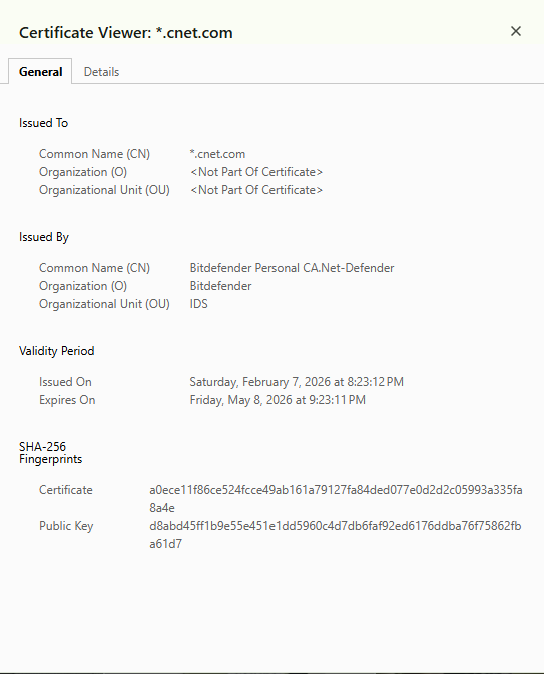

# Week 01 Lab — Certificate Inspection

## Screenshot Evidence

1. Capture a screenshot of the certificate details in your browser.
2. Save it as:

assets/screenshots/week-01/certificate-inspection.png

3. Embed the screenshot below:

## Website Information

**Website inspected:**  
<!-- www.cnet.com -->

**Issuer (Certificate Authority):**  
<!-- Bitdefender Personal CA.Net-Defender -->

**Valid from:**  
<!-- Saturday, February 7,2026 at 8:23:12PM -->

**Valid until:**  
<!-- Friday, May 8, 2026 at 9:23:11 PM -->

**Signature algorithm:**  
<!-- PKCS #1 SHA-256 With RSA Encryption -->

---

## Subject Alternative Names (SAN Entries)

List at least 2–3 SAN entries:

- DNS Name: *.cnet.com
- DNS Name: cnet.com
- 

---

## Observations

Document three observations about the certificate.

### Observation 1
<!-- The Certificate has a Serial Number Value. -->

### Observation 2
<!-- The Certificate is only Valid for about a month -->

### Observation 3
<!-- There are different Verisons of Certificates as this one is Version 3 -->

---

## Reflection

Based on your inspection, explain how this certificate contributes to secure HTTPS communication.

(2–3 sentences)
