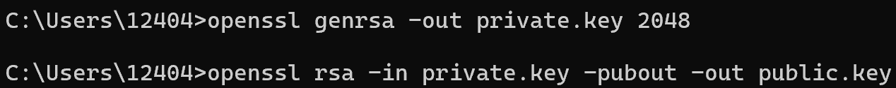

# Week 01 Lab — Key Pair Generation

## Screenshot Evidence

If using OpenSSL:
1. Capture a screenshot showing:
  - The command used to generate the private key
  - The command used to extract the public key
2. Save it as:

**assets/screenshots/week-01/keypair-generation.png**

3. Embed the screenshot below:

****

If using a browser-based generator, capture the generated key pair screen (redact sensitive portions of the private key before committing).

---

## Key Identification
**Which file is the public key?**
Shown in picture public.key

**Which file is the private key?**
As shown in picture private.key
---

## Key Properties
Briefly describe:
- What makes the public key safe to share
- A Public Key is innately built to only encrypt data and not decrypt.
- What makes the private key sensitive
- A Private key is sensitive because it is the only one tied to that asset as such if it's compromised Identity including things like banking information, legal documents etc. can be stolen and used or sold
- for nefarious purposes.

---

## Security Scenario
What would happen if someone obtained your private key?

Explain the risk in terms of:
  - Identity
  - Impersonation
  - Trust

  - If someone obtained my private key they could impersonate me to gain trust to different assets such as my banking info, social security or passport documents, even social media accounts can become compromised.

---

## Observations
Document three observations from this lab.

### Observation 1
<!-- What did you notice about key generation? -->
How quick and easy it is to generate the keys.

### Observation 2
<!-- What did you notice about key size or format? -->

### Observation 3
<!-- What did you notice about how the keys differ? -->
The private key was much longer.

---

## Reflection
In 3–5 sentences, explain:

Why must the private key remain secret in a PKI system?

Focus on how identity is tied to possession of the private key.
The Private key has to remain secret in a PKI system because the identity on the certificate is integral to showing proof of the identity and whether it can be trusted to move up the path of validation and down the path of delegation. If this is compromised not only will a certificate have to be created that means new keys for everything tied to it which can be time consuming and costly. The private key to me is the most important component of PKI and the protection of it must take highest priority.
