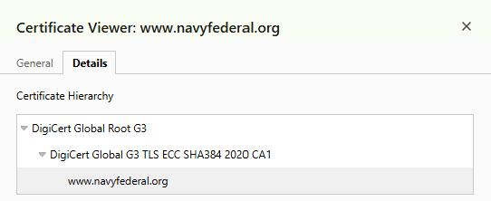

# Week 01 Mini Lab — Trust Chain Validation

## Screenshot Evidence

Capture a screenshot of the Certification Path (certificate chain) from your browser.

Save it as:

assets/screenshots/week-01/trust-chain-validation.png

Embed the screenshot below:

## Website Information

**Website inspected:**  
www.navyfederal.org

---

## Certificate Chain Breakdown

**Leaf (Server) Certificate**  
navyfederal

**Intermediate Certificate Authority**
Doesn't seem to have one? 

**Root Certificate Authority (Trust Anchor)**
Digicert Global Root G3

---

## Trust Anchor Verification

Is the Root CA marked as trusted by your system?

<!-- Yes / No -->
Yes
If yes, explain where that trust comes from (OS/browser root store).
Looks to be Browser root store.
If no, explain what warning or behavior occurred.

---

## Observations

Document three observations about the certificate.

### Observation 1
<!-- What did you notice about the chain structure? -->
It moved from Root DOWN 
### Observation 2
<!-- What did you notice about the Root CA? -->
TLS
### Observation 3
<!-- What did you notice about how the browser determines trust? -->
Not sure
---

## Reflection

In 3–5 sentences, explain:
- Why the Root certificate is called a trust anchor
- How validation walks the certificate chain
- What would happen if the Root CA were not trusted

Use your own words.
It's called a Trust Anchor because it sits on top of the entire Trust chain making it the highest level of authority in which verification from the lower certs gain their validity. Validation goes through the process of a claim being made by something like a site, it validates this Identity through control of a private key which then the a CA gives final stamp of approval and Validation happens. If the Root CA is not trusted then the whole process would have to start over, or if it's been compromised other steps to cure the issue will have to be taken.
